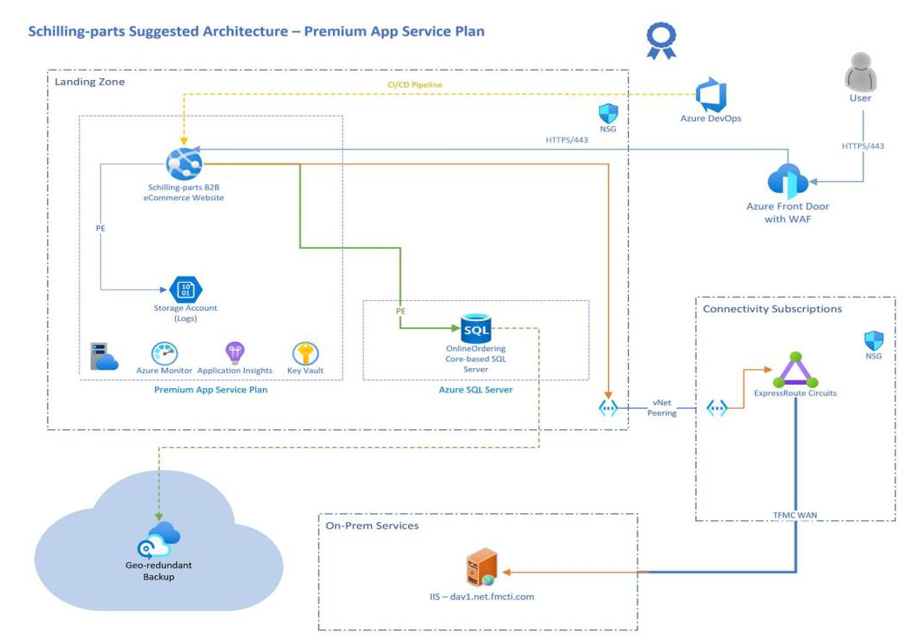

# Demo Landing Zone

## Table of Contents

* [Architecture](#architecture)
* [Pre-requisites](#pre-requisites)
* [:rocket: Getting started](#-rocket--getting-started)
  * [Setting up your environment](#setting-up-your-environment)
    * [Configure Terraform](#configure-terraform)
    * [Configure Remote Storage Account](#configure-remote-storage-account)
  * [Doing your first deployment](#doing-your-first-deployment)
    * [Configure Terraform Remote State](#configure-terraform-remote-state)
    * [Provide Parameters Required for Deployment](#provide-parameters-required-for-deployment)
    * [Deploy](#deploy)
* [:straight_ruler: Project Structure](#-straight-ruler--project-structure)
  * [Modules](#modules)
  * [Solutions](#solutions)
* [Naming Standards](#naming-standards)
* [Contributing](#contributing)
* [Code of conduct](#code-of-conduct)

This is a Terraform-based **demo** for the [Shilling parts suggested architecture](#architecture).

This project is meant to be used for educational purposes and **IS NOT PRODUCTION READY**.

## Architecture

### Overview



## Pre-requisites

1. [Terraform](#configure-terraform)
1. [Azure CLI](https://docs.microsoft.com/en-us/cli/azure/install-azure-cli)
1. Azure Subscription

## :rocket: Getting started

### Setting up your environment

#### Configure Terraform

If you haven't already done so, configure Terraform using one of the following options:

* [Configure Terraform in Azure Cloud Shell with Bash](https://docs.microsoft.com/en-us/azure/developer/terraform/get-started-cloud-shell-bash)
* [Configure Terraform in Azure Cloud Shell with PowerShell](https://docs.microsoft.com/en-us/azure/developer/terraform/get-started-cloud-shell-powershell)
* [Configure Terraform in Windows with Bash](https://docs.microsoft.com/en-us/azure/developer/terraform/get-started-windows-bash)
* [Configure Terraform in Windows with PowerShell](https://docs.microsoft.com/en-us/azure/developer/terraform/get-started-windows-powershell)

#### Configure Remote Storage Account

Before you use Azure Storage as a backend, you must create a storage account.
Run the following commands or configuration to create an Azure storage account and container:

Powershell

```powershell

$RESOURCE_GROUP_NAME='tfstate'
$STORAGE_ACCOUNT_NAME="tfstate$(Get-Random)"
$CONTAINER_NAME='tfstate'

# Create resource group
New-AzResourceGroup -Name $RESOURCE_GROUP_NAME -Location eastus

# Create storage account
$storageAccount = New-AzStorageAccount -ResourceGroupName $RESOURCE_GROUP_NAME -Name $STORAGE_ACCOUNT_NAME -SkuName Standard_LRS -Location eastus -AllowBlobPublicAccess $true

# Create blob container
New-AzStorageContainer -Name $CONTAINER_NAME -Context $storageAccount.context -Permission blob

```

For additional reading and documentation:

* [MS Doc: Store Terraform state in Azure Storage](https://docs.microsoft.com/en-us/azure/developer/terraform/store-state-in-azure-storage?tabs=azure-cli)
* [TF Doc: AzureRM Provider Configuration Documentation](https://www.terraform.io/language/settings/backends/azurerm)

### Doing your first deployment

#### Configure Terraform Remote State

To configure your Terraform deployment to use the newly provisioned storage account and container, navigate to [`./Solutions/App/version.tf`](./Solutions/App/version.tf) and update lines 10-13 as below:

```hcl

  backend "azurerm" {
    resource_group_name  = "my-rg-name"
    storage_account_name = "mystorageaccountname"
    container_name       = "tfstate"
    key                  = "ShillingParts/app.tfstate"
  }

```

* `resource_group_name`: Name of the Azure Resource Group that the storage account resides in.
* `storage_account_name`: Name of the Azure Storage Account to be used to hold remote state.
* `container_name`: Name of the Azure Storage Account Blob Container to store remote state.
* `key`: Path and filename for the remote state file to be placed in the Storage Account Container. If the state file does not exist in this path, Terraform will automatically generate one for you.

#### Provide Parameters Required for Deployment

As you configured the backend remote state with your live Azure infrastructure resource values, you must also provide them for your deployment.

1. Navigate to the template parameter file: [./Solutions/App/Parameters/uat.tfvars](./Solutions/App/Parameters/uat.tfvars)
    1. Leverage [variables.tf](./Solutions/App/version.tf) to get additional information/description about the parameters.
1. Copy the `uat.tfvars` file and paste it at the same level as the other `*.tf` files (`/Solutions/App`) and store it as `terraform.tfvars`
    1. These will be your deployment values, and will not be included with the current [`.gitignore`](./.gitignore) configuration.
1. Update the `terraform.tfvars` with your values

#### Deploy

1. Navigate to `/Solutions/App/` directory
1. Initialize Terraform to install all required providers specified within the `version.tf` across all modules

    ```bash
    terraform init
    ```

1. See the planned Terraform deployment and verify resource values

    ```bash
    terraform plan
    ```

1. Deploy

    ```bash
    terraform apply
    ```

## :straight_ruler: Project Structure

This repository is divided into two major components: `Modules` and `Solutions`

### Modules

Each module is named in the format of `<provider>-<service>` (e.g `azurerm-frontdoor`). For each of the modules, the structure is of the following:

```bash
├── Parameters
│   └── uat.tfvars
├── README.md
├── main.tf
├── outputs.tf
├── variables.tf
└── version.tf
```

* `Parameters/uat.tfvars`: Template variables go here, can be further leveraged to do deployment tests via automation
* `README.md`: Auto-generated documentation around module
* `main.tf`: Where the main Terraform module definition resides
* `outputs.tf`: Contains the outputs to return for the module
* `variables.tf`: Variable declarations for the module
* `version.tf`: Definition for providers and versions

### Solutions

After declaring the modules, the `Solutions` side is aimed towards using the modules as building blocks to deploy a packaged 'solution' all at once.

For the `App` solution, to break apart the numerous modules being referenced, the folder structure looks like the following:

```bash
├── Parameters
│   └── uat.tfvars
├── README.md
├── graph.svg
├── azurecaf-naming.tf
├── layer-app.tf
├── layer-data.tf
├── layer-monitoring.tf
├── layer-network.tf
├── layer-shared.tf
├── outputs.tf
├── variables.tf
└── version.tf
```

* `azurecaf-naming.tf`: Very first resource that will be deployed as all other resources are dependent on the naming convention this file generates
* `layer-app.tf`: Modules relevant to the app service `appservice-plan`, and `linux-webapp` module references
* `layer-data.tf`: Modules relevant to databases `mssql-server`, `mssql-server-database` module references
* `layer-monitoring.tf`: Modules relevant to monitoring `log-analytics-workspace`
* `layer-network.tf`: Modules relevant to networking `frontdoor`, `frontdoor-waf`, `nsgs`, `private-dns`, `private-endpoints`
* `layer-shared.tf`: Modules that are shared across layers `key-vault`, `storage account`
* `outputs.tf`: Values to be outputted post deployment
* `variables.tf`: Variable definitions for the deployment
* `version.tf`: Provider versions and remote state backend configuration

> You _can_ consolidate all of these layers into a single `main.tf`, but grouping your resources in a logical way can aide with cutting down management overhead, and also allow you to easily break apart each layer for a more 'sequential' deployment. (e.g: CICD pipeline that deploys each layer independently)

## Naming Standards

This project leverages the [azurecaf-name](https://registry.terraform.io/providers/aztfmod/azurecaf/latest/docs/resources/azurecaf_name) resource to centralize naming configuration for various resource types in Azure.


**Relevant Files:**

* [Solutions/App/azurecaf-naming.tf](./Solutions/App/azurecaf-naming.tf)
  * This is where the input parameters are passed into the module to create resources
* [Modules/azurecaf-naming/](./Modules/azurecaf-naming/)
  * This is the directory where the main Terraform module code exists for the `azurecaf-name` resource


**Parameters:**

* `country_code`: (Required) Short country code to use for the name (eg. eu for europe, na for north america), currently only North America (NA) and Europe (EU) are supported.
* `environment_code`: (Required) Numerical representation of the environment, `environment_code` must be a number of 02 (nonprod), 03 (backups), or 01 (prod).
* `application_name`: (Required) Product/Application name which will be appended as a suffix.
* `location`: (Required) location - example: South Central US = southcentralus, `location` must be one of the following: eastus, eastus2, southcentralus, westus.
* `owner`: (Required) Email or ID of the owner for the resource.
* `prefix`:(Optional) prefix to append as the first characters of the generated name - prefixes will be separated by the separator character
* `resource_type`: (Optional) - describes the type of azure resource you are requesting a name from (eg. azure container registry: azurerm_container_registry). See the Resource Type section

For example: `az-asp-NA02SCUS-JLeeParts-app`

* prefix = `az`
* resource_type = `asp` (generated shorthand based on resource_type initially fed)
* country_code = `NA`
* environment_code = `02`
* short_location = `SCUS` (derived from `southcentralus` via local mapping)
* application_name = `JLeeParts`
* suffix = `app`

**Why use `azurecaf-name`?**

Resources within Azure can be subject to various naming standards depending on the resource being created. For example, storage account names cannot include any special characters and must be alphanumeric with a max length of 24. Instead of formatting the name each time to accommodate for these scenarios, the `azurecaf-name` resource generates those names on your behalf, with the parameters it was given initially.

## Contributing

This project welcomes contributions and suggestions.  Most contributions require you to agree to a
Contributor License Agreement (CLA) declaring that you have the right to, and actually do, grant us
the rights to use your contribution. For details, visit <https://cla.opensource.microsoft.com>.

When you submit a pull request, a CLA bot will automatically determine whether you need to provide
a CLA and decorate the PR appropriately (e.g., status check, comment). Simply follow the instructions
provided by the bot. You will only need to do this once across all repos using our CLA.

## Code of conduct

This project has adopted the [Microsoft Open Source Code of Conduct](https://opensource.microsoft.com/codeofconduct/).
For more information see the [Code of Conduct FAQ](https://opensource.microsoft.com/codeofconduct/faq/) or
contact [opencode@microsoft.com](mailto:opencode@microsoft.com) with any additional questions or comments.
